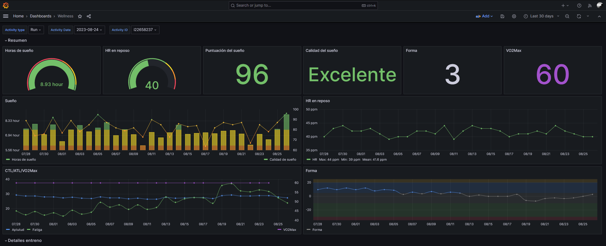

# Intervals.icu to influxDB
Script to export some data from [intervals.icu](https://intervals.icu) to [influxDB](https://www.influxdata.com/), so you can create your own dashboards, for example with [Grafana](https://grafana.com/).



## Exported data
Not all information is exported. This project has been created to extract only data from activities or wellness (sleep, VO2Max, etc.). Information about data account (email, location, preferences, etc.), calendar or workouts are not retreived.

Currently the follow data is exported:
- **Wellness**: this data contains information about sleep time and quality, act/ctl or VO2Max
- **Activities**: general information about every activity, like elapsed time, time in zones (hr or pace), distance, average pace/hr, etc.
- ***Streams*** (wip): streams contains detailed information about activities, like hr/pace for every second. Currently working on this type of data, so can be some errors

NOTE: in order to avoid influx timeout on saving data, activities are saved every 50, and streams every 20.

## How to use
1. Create a `.env` file on the root folder with the following values:

```
INFLUXDB_TOKEN=
INFLUXDB_ORG=
INFLUXDB_URL=
INFLUXDB_BUCKET=
INTERVALS_ATHLETE_ID=
INTERVALS_API_KEY=
```

2. Run:

```
docker build --tag intervals-to-influxdb .
```

2. Run:

```
docker run -it --rm intervals-to-influxdb app.py [start_date] [reset]
```

NOTE: if you set [start_date], all data from this date until today will be retreived. If not, only data for today. If you set [reset], the bucket on influxDB will be removed before start the process (this param must be on the second place, so if you want to get only the current day data and reset de bucket, you must to pass today date).

If you want to run with a cron job, use the following commad (recommended use without date, to get only the new data):

```
docker run --env-file path/to/.env --rm intervals-to-influxdb app.py [start_date]
```

1. If you want to run the script without Docker:

```
pip install -r requirements.txt
python app.py [start_date]
```