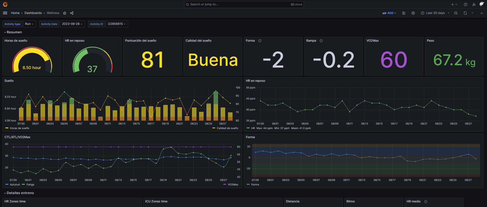
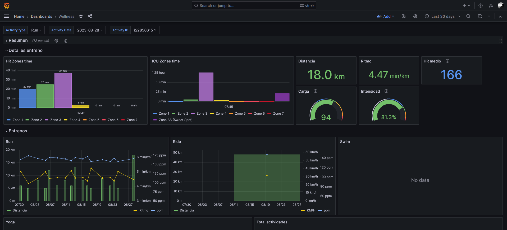

# Intervals.icu to influxDB
This script exports some data from [intervals.icu](https://intervals.icu) to [influxDB](https://www.influxdata.com/), so you can create your own dashboards, for example with [Grafana](https://grafana.com/). To retreive the information the official [intervals.icu API](https://intervals.icu/api/v1/docs/swagger-ui/index.html) is used.

The following screenshots are an example with Grafana:



## Exported data
Not all information is exported. This project has been created to extract only data from activities or wellness (sleep, VO2Max, etc.), and not all fields are saved (soreness, injury or systolic, for example, are not exported -for now-). Besides, information about data account (like email, location, preferences, etc.), calendar or workouts are not retreived neither.

Currently the following data is exported:
- **Wellness**: this data contains information like sleep time and quality, act/ctl or VO2Max
- \***Activities**: general information about every activity, like elapsed time, time in zones (hr or pace), distance, average pace/hr, etc.
- \*\****Streams***: streams contains detailed information about activities, like hr/pace for every second.

\* Common data is stored (time, distance, hr...). Specific data for every activity type (like pool distance for Swim, for example) is not stored. (Next steps)

\*\* Like activities, for now I'm working on Run streams. Another activity types streams are not exported (next steps)


## How to use
This script can be used with Docker or directly from code (with Python).

1. Download or clone this repository

2. Create a `.env` file on the root folder with the following values:

```
INFLUXDB_TOKEN=
INFLUXDB_ORG=
INFLUXDB_URL=
INFLUXDB_BUCKET=
INFLUXDB_TIMEOUT=10000
INTERVALS_ATHLETE_ID=
INTERVALS_API_KEY=
```

NOTE: If no bucket exists when run the script, a new one will be created.

### Docker

1. Compile the image:

```
docker build --tag intervals-to-influxdb .
```

2. Run a new container with the created image:

```
docker run -it --rm intervals-to-influxdb app.py app.py [-h] [--start-date START_DATE] [--end-date END_DATE] [--streams] [--reset]
```

Examples:
```
# First run
docker run -it --rm intervals-to-influxdb app.py --start-date 2023-01-01

# Update data from specific date (august)
docker run -it --rm intervals-to-influxdb app.py --start-date 2023-08-01

# Retreive data for today
docker run -it --rm intervals-to-influxdb app.py

# Retreive data without streams
docker run -it --rm intervals-to-influxdb app.py --no-streams

# Reset buket (start_date is required)
docker run -it --rm intervals-to-influxdb app.py --start-date 2023-01-01 --reset
```

If you want to run with a cron job, use the following commad (recommended use without date, to get only the new data):

```
docker run --rm intervals-to-influxdb app.py
```

### Directly with Python
1. Install dependencies:

```
pip install -r requirements.txt
```

2. Run the script
```
python app.py [-h] [--start-date START_DATE] [--end-date END_DATE] [--streams] [--reset]
```

Examples:
```
# First run
python app.py --start-date 2023-01-01

# Update data from specific date (august)
python app.py --start-date 2023-01-01

# Retreive data for today
python app.py

# Retreive data without streams
python app.py --no-streams

# Reset buket (start_date is required)
python app.py --start-date 2023-01-01 --reset
```

## Options
The following options are available:
```
-h, --help              show this help message and exit
--start-date START_DATE Start date in format YYYY-MM-DD
--end-date END_DATE     End date in format YYYY-MM-DD
--streams               Export streams for the activities
--reset                 Reset influx bucket (delete and create)
```