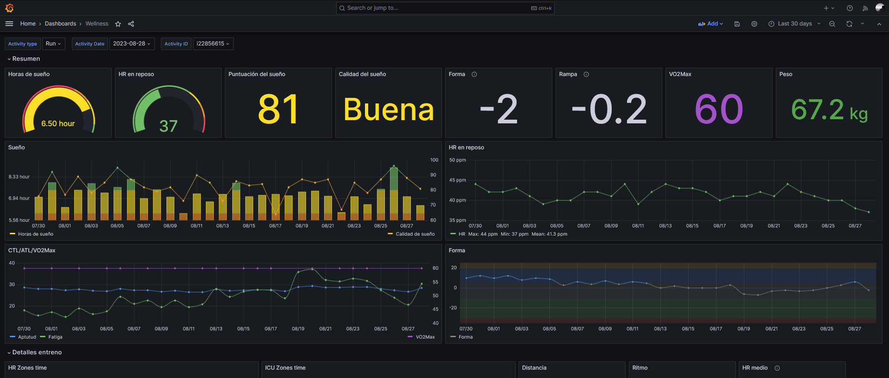
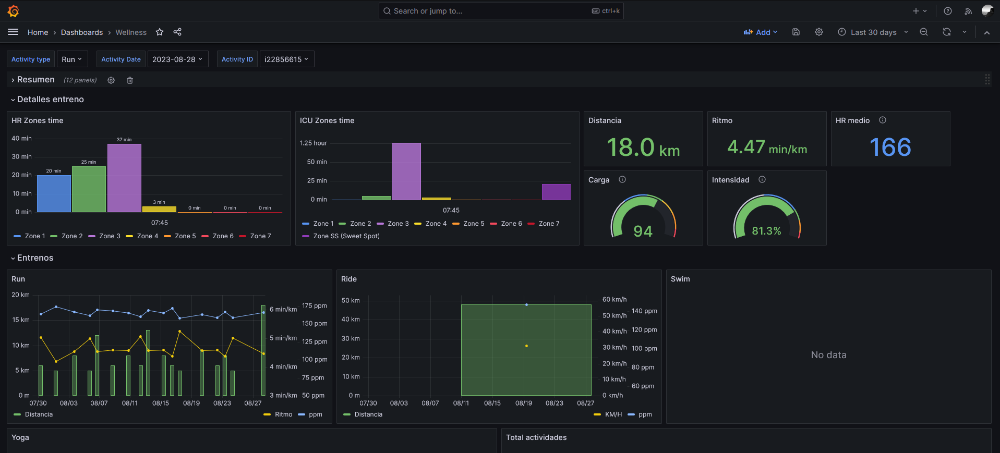

# Intervals.icu to InfluxDB
Intervalsicu-to-influxdb extracts data from Intervals.icu to InfluxDB (oh, really?). But if Intervals.icu already shows a lot of graphics, statistics and more, why I need to extract it?

Full documentation can be found in [here](https://intervalsicu-to-influxdb.readthedocs.io)

## Why
Well, as a sportsman and techie, it's just a personal project, but the main reason is because I want to create my own dashboards (using Grafana in this case).

So, for example, I can combine activity data with sleep time or quality, compare the evolution between pace/bpm for the similar activities or whatever.




## How it works
This project exports some data from [intervals.icu](https://intervals.icu) to [influxDB](https://www.influxdata.com/). To retrieve the information the official [intervals.icu API](https://intervals.icu/api/v1/docs/swagger-ui/index.html) is used.

### Exported data
Not all information is exported. This project has been created to extract data from activities and wellness. Besides, information about data account (like email, location, preferences, etc.), calendar or workouts are not retrieved neither (for now).

Currently the following data is exported:
- **Wellness**\*: this data contains information like sleep time and quality, atl/ctl or VO2Max
- **Activities**\*: general information about every activity, like elapsed time, time in zones (hr or pace), distance, average pace/hr, etc.
- **Streams**\*\*: streams contains detailed information about activities, like hr/pace for every second.

\* There are som extra fields generated, just to facilitate the use for the dashboards, and some "complex fields" cannot be retrieved yet (see [Entities](Entities.md))

\*\* Currently working on it.

## How to use
There are 2 ways (3 if you count 'from source code') to use the project: with Docker or directly with Python (or from source code), but in both cases you need to create a `.env` file to save your credentials for Intervals.icu and InfluxDB as follow:

```
INFLUXDB_TOKEN=
INFLUXDB_ORG=
INFLUXDB_URL=
INFLUXDB_BUCKET=
INFLUXDB_TIMEOUT=10000
INTERVALS_ATHLETE_ID=
INTERVALS_API_KEY=
```

### Docker
To use with Docker, just run the following command:

```bash
docker run --env-file PATH/TO/FILE -it --rm tmllull/intervals-to-influxdb app.py [-h] [--start-date START_DATE] [--end-date END_DATE] [--streams] [--reset]
```

#### Arguments
All the arguments are optional, but take in consideration the following variations when run it:

- No arguments: retrieve the wellness and activities data for today (this is the basic use to run with a cronjob)
- Start date: retrieve data from the starting date (in format YYYY-MM-DD) until today
- End date: retrieve data until specified date (in format YYYY-MM-DD). Use it with `start-date`
- Streams: retrieve the streams for the activities
- Reset: delete the current bucket and recreate again

NOTE: on the first run, the bucket is created automatically if not exists on InfluxDB

### With Python
If you want to run it directly with Python, first install the dependency:

```bash
pip install intervalsicu-to-influxdb
```

Then, the minimum code to run it is (remember to put the `.env` file on the same folder):

```python
from intervalsicu_to_influxdb.extractor import IntervalsToInflux

extractor = IntervalsToInflux()
extractor.all_data()
```

To run it, just save as `app.py` and run it:

```bash
python app.py
```

#### Arguments
As the Docker way, we can pass arguments when create the extractor. For example:

```python
extractor = IntervalsToInflux(start_date="2023-01-01")
```
```python
extractor = IntervalsToInflux(streams=True)
```
```python
extractor = IntervalsToInflux(start_date="2023-01-01", end_date="2023-05-01")
```
#### Dynamic script
If you want to create a more dynamic script, here is a more complete example:

```python
import argparse

from intervalsicu_to_influxdb.extractor import IntervalsToInflux

parser = argparse.ArgumentParser()

parser.add_argument("--start-date", type=str, help="Start date in format YYYY-MM-DD")
parser.add_argument("--end-date", type=str, help="End date in format YYYY-MM-DD")
parser.add_argument(
    "--streams",
    action="store_true",
    help="Export streams for the activities",
)
parser.add_argument(
    "--reset", action="store_true", help="Reset influx bucket (delete and create)"
)

args = parser.parse_args()

if args.start_date:
    start_date = args.start_date
else:
    start_date = None
if args.end_date:
    end_date = args.end_date
else:
    end_date = None
if args.streams:
    streams = True
else:
    streams = False
if args.reset:
    reset = True
else:
    reset = False

extractor = IntervalsToInflux(start_date, end_date, reset, streams)
extractor.all_data()
```

Then, just run the script as before, but you will can use arguments (same as the Docker section):

```bash
python app.py [-h] [--start-date START_DATE] [--end-date END_DATE] [--streams] [--reset]
```

### From source code
If you want to run it from source code, just clone the project, and the follow the next steps (remember to create the `.env` file):

#### Run with Docker
First, compile the image
```bash
docker build --tag intervals-to-influxdb .
```
And then, just run it like the Docker section above (but with the image name)

```bash
docker run --env-file PATH/TO/FILE -it --rm intervals-to-influxdb app.py [-h] [--start-date START_DATE] [--end-date END_DATE] [--streams] [--reset]
```

#### Run with Python
First, install dependencies from source
```
pip install .
```

And then, run the script
```
python app.py [-h] [--start-date START_DATE] [--end-date END_DATE] [--streams] [--reset]
```